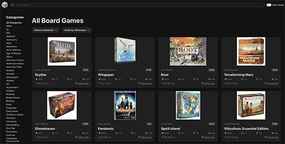

<!-- Improved compatibility of back to top link: See: https://github.com/othneildrew/Best-README-Template/pull/73 -->

<!--
*** Thanks for checking out the Best-README-Template. If you have a suggestion
*** that would make this better, please fork the repo and create a pull request
*** or simply open an issue with the tag "enhancement".
*** Don't forget to give the project a star!
*** Thanks again! Now go create something AMAZING! :D
-->

<!-- PROJECT SHIELDS -->
<!--
*** I'm using markdown "reference style" links for readability.
*** Reference links are enclosed in brackets [ ] instead of parentheses ( ).
*** See the bottom of this document for the declaration of the reference variables
*** for contributors-url, forks-url, etc. This is an optional, concise syntax you may use.
*** https://www.markdownguide.org/basic-syntax/#reference-style-links
-->

[![Forks][forks-shield]][forks-url]
[![Issues][issues-shield]][issues-url]
[![LinkedIn][linkedin-shield]][linkedin-url]

<!-- PROJECT LOGO -->
 

  

<h3 align="center">Board Game Discovery</h3>

  

    This project originally originated from a Code with Mosh React Tutorial that aimed to build a website for video games. However, I customized it by integrating a different API to focus on board games, aligning it with my personal interest and hobby.
     
    <a href="https://github.com/JustinSixsmith/board-game-discovery"><strong>Explore the docs »</strong></a>
     
     
    <a href="https://board-game-discovery.vercel.app/">View Demo</a>
    ·
    <a href="https://github.com/JustinSixsmith/board-game-discovery/issues">Report Bug</a>
    ·
    <a href="https://github.com/JustinSixsmith/board-game-discovery/issues">Request Feature</a>
  

<!-- TABLE OF CONTENTS -->

  
Table of Contents

  <ol>
    <li>
      <a href="#about-the-project">About The Project</a>
      <ul>
        <li><a href="#built-with">Built With</a></li>
      </ul>
    </li>
    <li>
      <a href="#getting-started">Getting Started</a>
      <ul>
        <li><a href="#prerequisites">Prerequisites</a></li>
        <li><a href="#installation">Installation</a></li>
      </ul>
    </li>
    <li><a href="#usage">Usage</a></li>
    <li><a href="#roadmap">Roadmap</a></li>
    <li><a href="#contributing">Contributing</a></li>
    <li><a href="#license">License</a></li>
    <li><a href="#contact">Contact</a></li>
    <li><a href="#acknowledgments">Acknowledgments</a></li>
  </ol>

<!-- ABOUT THE PROJECT -->

## About The Project

[![Product Name Screen Shot][product-screenshot]](https://board-game-discovery.vercel.app/)

Board Game Discovery is a dynamic, user-friendly platform for board game enthusiasts. It showcases an extensive database of games, complete with detailed descriptions, ratings, and user reviews. The platform features a personalized recommendation system, designed to help users discover new games based on their preferences. Whether you are a seasoned player, a newcomer to the board game scene, or a potential employer exploring innovative frontend designs, Board Game Discovery offers a seamless, engaging, and insightful journey into the world of board games.

(<a href="#readme-top">back to top</a>)

### Built With

- [![React][React.js]][React-url]
- [![Typescript][Typescript.com]][Typescript-url]
- [![Chakra][Chakra.com]][Chakra-url]
- [![React-query][React-query.com]][React-query-url]
- [![Vite][Vite.com]][Vite-url]
- [![Vercel][Vercel.com]][Vercel-url]

(<a href="#readme-top">back to top</a>)

<!-- GETTING STARTED -->

## Getting Started

To get started with Board Game Discovery, follow these steps:

1. Clone this repository to your local machine.
2. Run `npm install` to install the required dependencies.
3. Get a Board Game Atlas API key at https://www.boardgameatlas.com/api/docs. You'll have to create an account first.
4. Add the API key to **src/services/api-client.ts**
5. Run `npm run dev` to start the web server.

<!-- ROADMAP -->

## Roadmap

- [ ] Search by Category
- [ ] Filter by Game Mechanics
- [ ] Sort by Relevance
  - [ ] Selected Game Details Page

See the [open issues](https://github.com/JustinSixsmith/board-game-discovery/issues) for a full list of proposed features (and known issues).

(<a href="#readme-top">back to top</a>)

<!-- CONTRIBUTING -->

## Contributing

Contributions are what make the open source community such an amazing place to learn, inspire, and create. Any contributions you make are **greatly appreciated**.

If you have a suggestion that would make this better, please fork the repo and create a pull request. You can also simply open an issue with the tag "enhancement".
Don't forget to give the project a star! Thanks again!

1. Fork the Project
2. Create your Feature Branch (`git checkout -b feature/AmazingFeature`)
3. Commit your Changes (`git commit -m 'Add some AmazingFeature'`)
4. Push to the Branch (`git push origin feature/AmazingFeature`)
5. Open a Pull Request

(<a href="#readme-top">back to top</a>)

<!-- CONTACT -->

## Contact

Justin Sixsmith - justinsixsmith@gmail.com

Project Link: [https://github.com/github_username/repo_name](https://github.com/JustinSixsmith/board-game-discovery)

(<a href="#readme-top">back to top</a>)

<!-- ACKNOWLEDGMENTS -->

## Acknowledgments

- [Code with Mosh](https://codewithmosh.com)

(<a href="#readme-top">back to top</a>)

<!-- MARKDOWN LINKS & IMAGES -->
<!-- https://www.markdownguide.org/basic-syntax/#reference-style-links -->

[contributors-shield]: https://img.shields.io/github/contributors/JustinSixsmith/board-game-discovery.svg?style=for-the-badge
[contributors-url]: https://github.com/github_username/repo_name/graphs/contributors
[forks-shield]: https://img.shields.io/github/forks/JustinSixsmith/board-game-discovery.svg?style=for-the-badge
[forks-url]: https://github.com/JustinSixsmith/board-game-discovery/fork
[stars-shield]: https://img.shields.io/JustinSixsmith/board-game-discovery/repo_name.svg?style=for-the-badge
[stars-url]: https://github.com/JustinSixsmith/board-game-discovery/stargazers
[issues-shield]: https://img.shields.io/github/issues/JustinSixsmith/board-game-discovery.svg?style=for-the-badge
[issues-url]: https://github.com/JustinSixsmith/board-game-discovery/issues
[linkedin-shield]: https://img.shields.io/badge/-LinkedIn-black.svg?style=for-the-badge&logo=linkedin&colorB=555
[linkedin-url]: https://linkedin.com/in/justin-sixsmith
[product-screenshot]: public/board-game-discovery.jpeg
[React.js]: https://img.shields.io/badge/React-20232A?style=for-the-badge&logo=react&logoColor=61DAFB
[React-url]: https://reactjs.org/
[Typescript.com]: https://camo.githubusercontent.com/773cfd323f61dbc7301a98e28c69fbd0f27f491272f4acf48106936ca1d14c47/68747470733a2f2f696d672e736869656c64732e696f2f7374617469632f76313f7374796c653d666f722d7468652d6261646765266d6573736167653d5479706553637269707426636f6c6f723d333137384336266c6f676f3d54797065536372697074266c6f676f436f6c6f723d464646464646266c6162656c3d
[Typescript-url]: https://www.typescriptlang.org/
[Chakra.com]: https://camo.githubusercontent.com/9be161579f0737f301d45929820470e22ad2af41a92524b150dca40fce3c765d/68747470733a2f2f696d672e736869656c64732e696f2f7374617469632f76313f7374796c653d666f722d7468652d6261646765266d6573736167653d4368616b72612b554926636f6c6f723d333139373935266c6f676f3d4368616b72612b5549266c6f676f436f6c6f723d464646464646266c6162656c3d
[Chakra-url]: https://chakra-ui.com/
[React-query.com]: https://camo.githubusercontent.com/2c53895491eecd8aed53655963595ae41628198bd1d5939fa100b11ee9e2513f/68747470733a2f2f696d672e736869656c64732e696f2f7374617469632f76313f7374796c653d666f722d7468652d6261646765266d6573736167653d52656163742b517565727926636f6c6f723d464634313534266c6f676f3d52656163742b5175657279266c6f676f436f6c6f723d464646464646266c6162656c3d
[React-query-url]: https://tanstack.com/query/v3/
[Vite.com]: https://camo.githubusercontent.com/d96a01edb67770ddc4a8794895b4e2c1fab10e9fab40060b287bcb3448915a01/68747470733a2f2f696d672e736869656c64732e696f2f7374617469632f76313f7374796c653d666f722d7468652d6261646765266d6573736167653d5669746526636f6c6f723d363436434646266c6f676f3d56697465266c6f676f436f6c6f723d464646464646266c6162656c3d
[Vite-url]: https://vitejs.dev/
[Vercel.com]: https://camo.githubusercontent.com/ac911ed7941e047950a141607fed83bc6cd654187b72dd758f7810476ebffaef/68747470733a2f2f696d672e736869656c64732e696f2f7374617469632f76313f7374796c653d666f722d7468652d6261646765266d6573736167653d56657263656c26636f6c6f723d303030303030266c6f676f3d56657263656c266c6f676f436f6c6f723d464646464646266c6162656c3d
[Vercel-url]: https://vercel.com/
